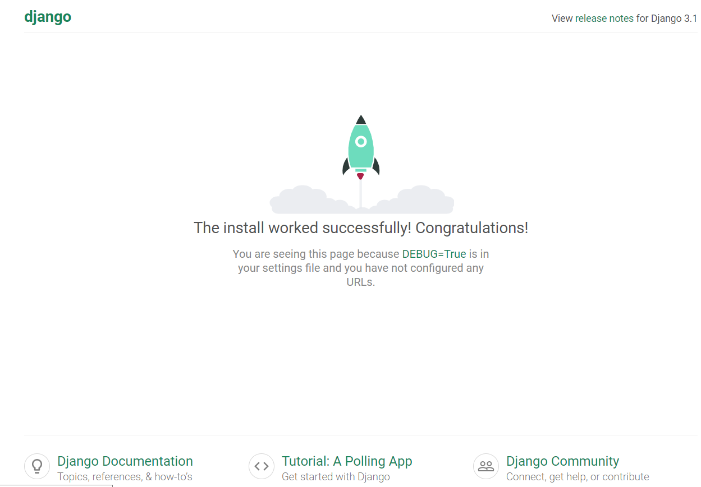
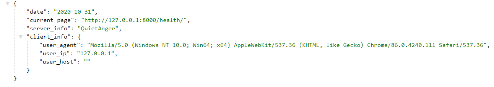

# Lab_3: Вступ до моніторингу.

+ Створення віртуального середовища, встановлення Django
```
pipenv --python 3.8
pipenv install django
```
+ Створення ногово проекту Django
```
django-admin startproject django_app
``` 
+  Запуск Django сервера
```
python manage.py runserver
```
Локальний сервер запущено на порті: 8000



+ Створено файл `.gitignore`, внесено файли ігнорування. 
+ Створення нового Django додатку
```
python manage.py startapp geo
```
+ Створено нову директорію `./geo/templates`, створено файли `./geo/templates/index.html` та `./geo/urls.py`

+ Добавлення додатку до константи `INSTALLED_APPS`
```python
INSTALLED_APPS = [
    'geo',
    'django.contrib.admin',
    'django.contrib.auth',
    'django.contrib.contenttypes',
    'django.contrib.sessions',
    'django.contrib.messages',
    'django.contrib.staticfiles',
]
```
+ Додавання індексації додатку у файлі посилань `urls.py`

```python
from django.urls import path, include

urlpatterns = [
    path('admin/', admin.site.urls),
    path('', include('geo.urls')),
    path('health/', include('geo.urls'))
]
``` 

+ Встановлення модуля `requests` для pipenv
```
pipenv install requests
```

+ Скрипти (аліаси), добавлені у Pipfile, виконуються командою `pipenv run [script_name]`
```python
[scripts]
server = "python manage.py runserver"
mon = "python monitoring.py"
```

+ Добавлено логування при помилці підключення до сервера
```
ERROR 2020-11-01 15:40:37,014 root : Сервер недоступний
ERROR 2020-11-01 15:40:37,014 root : Помилка: HTTPConnectionPool(host='localhost', port=8000): Max retries exceeded with url: /health (Caused by NewConnectionError('<urllib3.connection.HTTPConnection object at 0x02E7A508>: Failed to establish a new connection: [WinError 10061] No connection could be made because the target machine actively refused it'))
```
+ Встановлено щохвилинне опитування сервера
+ Виконати `monitoring.py` у фоновому режимі можна за допомогою команди `bg` або ж `python3 monitoring.py &`

+ #### Результати JSON відповіді функції health


+ #### Результати зчитування HTML темплейта


